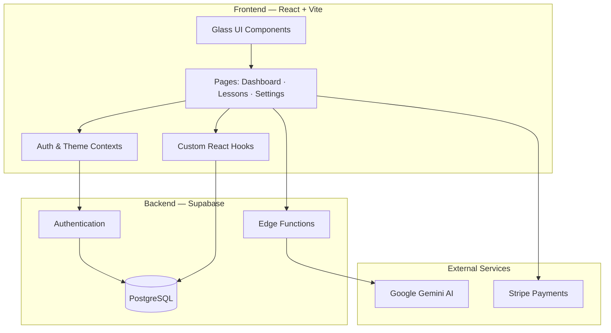

<div align="center">


# Relearnable

**AI-powered adaptive learning platform — personalized flashcards, quizzes, and intelligent curriculum trees.**

[](https://react.dev/)
[](https://www.typescriptlang.org/)
[](https://supabase.com/)
[](https://ai.google.dev/)
[](https://stripe.com/)

[Live Demo](https://relearnable.ai) · [Portfolio](https://sahilkamal.dev) · [LinkedIn](https://linkedin.com/in/sahilkamalny) · [Contact](mailto:sahilkamal.dev@gmail.com)

**Built with** React 18 · TypeScript · Vite · Supabase · Google Gemini · Stripe · Framer Motion · Tailwind CSS · Recharts

</div>

---

## Overview

Relearnable is a full-stack adaptive learning application that uses AI to generate personalized study content on any topic. Users can learn from scratch via AI-crafted flashcard and quiz lessons, or take placement tests that identify knowledge gaps and build targeted remediation curricula. Progress is tracked visually through an interactive knowledge graph and a radar chart spanning 15 subject categories.

---

## Screenshots

<div align="center">

| Landing Page | Dashboard |
|:---:|:---:|
|  |  |

| Flashcard Lesson | Interactive Quiz |
|:---:|:---:|
|  |  |

| Curriculum Tree | Mastery Tracking |
|:---:|:---:|
|  |  |

</div>

---

## Features

**Adaptive Learning Engine**
- *Learn Mode* — AI generates structured lessons as flashcards and quizzes for any topic
- *Relearn Mode* — Placement tests surface knowledge gaps and produce targeted remediation paths
- Beginner, Intermediate, and Advanced content difficulty options

**Knowledge Graph**
- Interactive node-based curriculum tree with locked / unlocked / completed states
- Pan, zoom, and touch navigation; graph expands dynamically as topics are mastered

**Mastery Tracking**
- Radar chart visualization across 15 knowledge categories (Recharts)
- Real-time score updates persisted to the database on lesson completion

**AI Content Generation**
- Google Gemini API (`gemini-2.0-flash`) called through Supabase Edge Functions — API keys never exposed to the client
- Structured JSON output for lessons, quizzes, and placement test flows

**Subscription Management**
- Stripe Checkout, Customer Portal, and Webhooks for recurring billing
- Free tier with usage limits; monthly and annual premium plans

**UI / UX**
- Custom glassmorphic design system built on Tailwind CSS
- Framer Motion micro-animations and layout transitions throughout
- Full dark / light mode with system preference detection
- PWA manifest for mobile home-screen installation

---

## Architecture



**Key decisions**

| Concern | Choice | Rationale |
|---|---|---|
| Frontend | React 18 + TypeScript | Type safety, modern hooks, large ecosystem |
| Build | Vite 5 | Sub-second HMR, optimized production output |
| Styling | Tailwind CSS 4 + CSS variables | Rapid iteration with a consistent token system |
| Animation | Framer Motion 11 | Declarative API, gesture support, layout animations |
| Backend | Supabase | Auth, real-time database, and edge functions in one service |
| AI | Gemini via Edge Functions | Server-side key isolation; structured JSON responses |
| Payments | Stripe | Webhook reliability, hosted portal, subscription lifecycle |
| Charts | Recharts | React-native, responsive, composable chart primitives |

---

## Project Structure

```
relearnable/
├── src/
│   ├── components/ui/        # Glassmorphic design-system primitives
│   └── assets/               # SVG icons and static images
├── components/               # Feature components
│   ├── KnowledgeGraph.tsx    # Interactive curriculum tree
│   ├── MasteryChart.tsx      # Radar chart visualization
│   ├── Quiz.tsx              # Quiz engine with per-question explanations
│   └── Flashcard.tsx         # Flip-animated flashcard
├── pages/                    # Route-level components
│   ├── Dashboard.tsx         # Main learning hub
│   ├── LessonView.tsx        # Flashcard & quiz lesson flow
│   ├── Settings.tsx          # Account and subscription management
│   └── LandingPage.tsx       # Marketing page and auth entry point
├── services/                 # External integrations
│   ├── databaseService.ts    # Supabase CRUD with optimistic updates
│   ├── geminiService.ts      # AI content generation helpers
│   └── stripeService.ts      # Checkout and portal session creation
├── contexts/
│   ├── AuthContext.tsx        # Session and user state
│   └── ThemeContext.tsx       # Dark / light mode
├── hooks/                    # Shared custom hooks
├── supabase/functions/       # Deno edge functions (AI proxy)
└── types.ts                  # Shared TypeScript definitions
```

---

## Code Samples

Representative excerpts are included for portfolio review.

| Sample | Description |
|---|---|
| [`types/models.ts`](code-samples/types/models.ts) | Core TypeScript interfaces for learning entities |
| [`hooks/useInstallPrompt.ts`](code-samples/hooks/useInstallPrompt.ts) | PWA install-prompt hook with browser API integration |
| [`components/GlassButton.tsx`](code-samples/components/GlassButton.tsx) | Reusable glassmorphic button with Framer Motion and dark mode |
| [`components/ThinkingPills.tsx`](code-samples/components/ThinkingPills.tsx) | Animated AI "thinking" loading indicator |

---

## Tech Stack

| Layer | Technologies |
|---|---|
| Core | React 18, TypeScript 5.3, Vite 5 |
| Styling | Tailwind CSS 4, Custom CSS variables |
| Animation | Framer Motion 11, CSS keyframe animations |
| State | React Context API, custom hooks |
| Routing | React Router 6 |
| Backend | Supabase — Auth, PostgreSQL, Edge Functions (Deno) |
| AI | Google Gemini API (`gemini-2.0-flash`) |
| Payments | Stripe — Checkout, Webhooks, Customer Portal |
| Charts | Recharts — Radar, ResponsiveContainer |
| Effects | tsparticles, canvas-confetti |

---

## Contact

**Sahil Kamal** — Full-Stack Developer

[sahilkamal.dev](https://sahilkamal.dev) · [linkedin.com/in/sahilkamalny](https://linkedin.com/in/sahilkamalny) · [sahilkamal.dev@gmail.com](mailto:sahilkamal.dev@gmail.com)

---

<div align="center">

*This repository contains documentation and representative code samples for portfolio purposes. Full source code is proprietary.*

**© 2026 Sahil Kamal. All Rights Reserved.**

</div>
